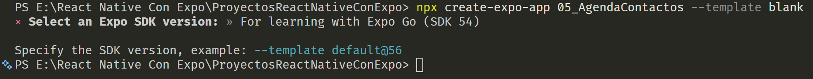
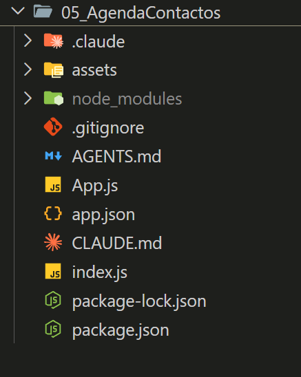
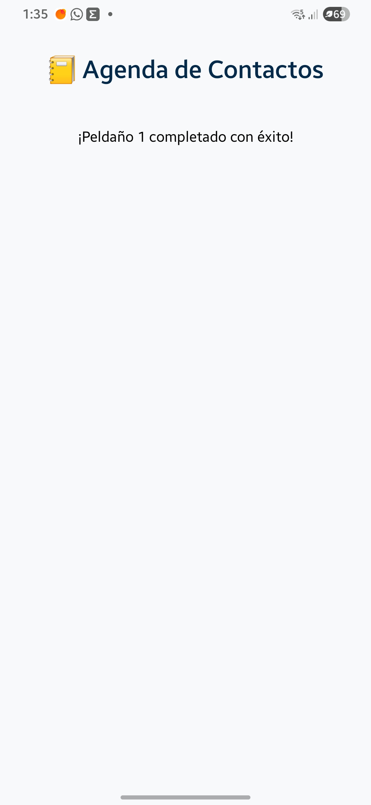
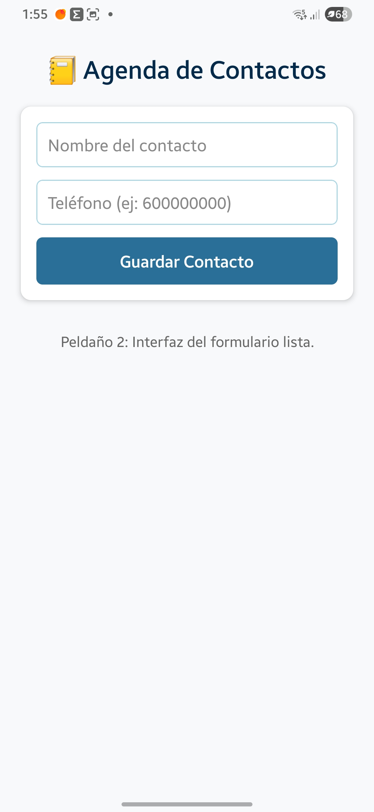
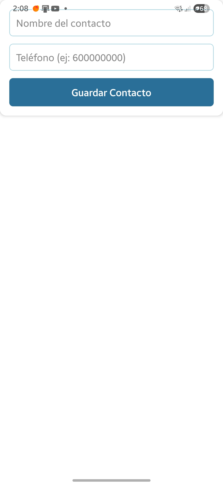
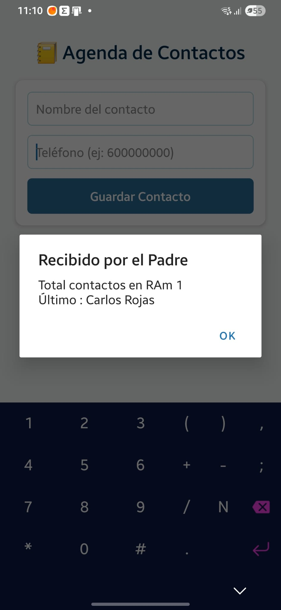
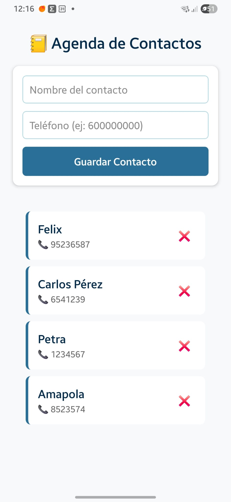

# PROYECTO AGENDA DE CONTACTOS.

## CREACION DE AMBIENTE DE TRABAJO.
En nuestra carpeta de proyectos de React Native + Expor ejecutamos, en la terminal,  el comando:

### 1. Creacion del Proyecto

Aplicamos el siguiente comando, con el nombre del proyecto ( 05_AgendaContactos )

```bash
npx create-expo-app 05_AgendaContactos --template blank
```
Elegimos la version del SDK54, bajando con las flechas, desde el 56 al 54.


Nos creara un directorio con App.js en la raiz.

Sin `--template blank` creará un proyecto con todas las carpetas de un proyecto moderno, pero como queremos ir construyendo el proyecto poco a poco usamos el `--template blank`.

Directorio virgen, creado por la instruccion que aplicamos en la terminal:


### 2. Creacion de librería de almacenamiento para manejo de la base de datos.

Aplicamos el comando, DENTRO DE LA CARPETA DE NUESTRO PROYECTO ( 05_AgendaContactos):

---
```Bash
npx expo install @react-native-async-storage/async-storage
```
---


Aqui el detalle de la aplicacion del comando:

```bash
PS E:\React Native Con Expo\ProyectosReactNativeConExpo\05_AgendaContactos> npx expo install @react-native-async-storage/async-storage
› Installing 1 SDK 54.0.0 compatible native module using npm
> npm install

added 3 packages, and audited 703 packages in 3s

52 packages are looking for funding
  run `npm fund` for details

11 moderate severity vulnerabilities

To address issues that do not require attention, run:
  npm audit fix

To address all issues (including breaking changes), run:
  npm audit fix --force

Run `npm audit` for details.
PS E:\React Native Con Expo\Proyect
```

### 📂 Paso 3: La Estructura de Carpetas Profesional
Ahora, abrimos únicamente la carpeta 05_AgendaContactos en Visual Studio Code (File > Open Folder).

Para modularizar, no podemos dejarlo todo suelto en la raíz. Vamos a crear una estructura limpia. Dentro de la raíz del proyecto, crea una carpeta llamada src, y dentro de ella, crea las siguientes subcarpetas.

Tu árbol de archivos debería verse así:

---
```txt
05_AgendaContactos/
├── App.js                   (El director de orquesta, limpio y cortito)
├── package.json
└── src/                     (Toda nuestra lógica irá aquí dentro)
    ├── components/          (Para los botones, inputs y filas de contactos)
    ├── services/            (Para la lógica de AsyncStorage)
    └── styles/              (Para los archivos de diseño y colores)
```
---

🏛️ Paso 3: El Plan de Ataque Modular
En las próximas sesiones, iremos creando los archivos uno a uno para repartir las responsabilidades:

src/styles/globalStyles.js: Aquí meteremos toda la paleta de colores y los diseños de los contenedores. App.js no tendrá un StyleSheet.create gigante abajo.

src/services/contactoStorage.js: Aquí aislaremos el getItem y setItem. Nuestro programa principal solo dirá "guarda" o "carga", sin saber cómo funciona la librería por dentro.

src/components/ContactoCard.js: El componente visual que pintará cada contacto en la FlatList (reemplazando al antiguo renderItem interno).

src/components/ContactoForm.js: El formulario con los inputs para escribir el nombre y teléfono.

🎯 Tu primer paso para dejar el laboratorio listo
Para dejar el entorno preparado antes de irnos a descansar, crea dentro de la carpeta src/styles/ un archivo llamado globalStyles.js.

Vamos a estrenar la modularización sacando los estilos fuera. Copia y pega este código dentro de ese nuevo archivo:

---
```js
// src/styles/globalStyles.js
import { StyleSheet } from 'react-native';

export const colores = {
    primario: '#2A6F97',
    secundario: '#A9D6E5',
    fondo: '#F8F9FA',
    texto: '#012A4A',
    blanco: '#FFFFFF',
    rojo: '#E63946'
};

export const globalStyles = StyleSheet.create({
    container: {
        flex: 1,
        backgroundColor: colores.fondo,
        paddingTop: 50,
        paddingHorizontal: 20,
    },
    titulo: {
        fontSize: 24,
        fontWeight: 'bold',
        color: colores.texto,
        textAlign: 'center',
        marginBottom: 20,
    }
});
```
---

Fíjate en un detalle clave: usamos la palabra `export` delante de las constantes ( `const` ). Eso es lo que le da el superpoder a otros archivos de poder "importar" este diseño.

# RUTA O PASOS GLOBALES DE NUESTRO PROYECTO AGENDA DE CONTACTO.

1. Conectar el App.js con los estilos globales y pintar el diseño base.

2. Diseñar el formulario de entrada (inputs para Nombre y Teléfono) en su propio componente modular.

3. Crear el estado de la lista en la RAM (useState) usando la estructura de ID Único.

4. Diseñar la tarjeta visual del contacto (renderItem modular).

5. Conectar la persistencia (el almacenamiento).

# 🪜 1: Conectar App.js y probar la importación modular
El objetivo de este primer paso es asegurarnos de que la tubería entre el archivo raíz (App.js) y tu archivo de estilos (src/styles/globalStyles.js) funciona perfectamente sin romper la aplicación.

Abrimos archivo App.js en la raíz. Borra lo que tenga y vamos a dejarlo con la estructura mínima inicial:


```js
// App.js (Raíz del proyecto)
import React from 'react';
import { StatusBar } from 'expo-status-bar';
import { Text, View } from 'react-native';

// Importamos el estilo global usando la ruta relativa
import { globalStyles } from '../styles/globalStyles';

export default function App() {
  return (
    <View style={globalStyles.container}>
      <Text style={globalStyles.titulo}>📒 Agenda de Contactos</Text>
      
      <Text style={{ textAlign: 'center', marginTop: 20 }}>
        ¡Peldaño 1 completado con éxito!
      </Text>

      <StatusBar style="auto" />
    </View>
  );
}
```
Al ejecutar el programa anterior fue:



Solo como referencia , el archivo original era asi:

```js
import { StatusBar } from 'expo-status-bar';
import { StyleSheet, Text, View } from 'react-native';

export default function App() {
  return (
    <View style={styles.container}>
      <Text>Open up App.js to start working on your app!</Text>
      <StatusBar style="auto" />
    </View>
  );
}

const styles = StyleSheet.create({
  container: {
    flex: 1,
    backgroundColor: '#fff',
    alignItems: 'center',
    justifyContent: 'center',
  },
});

```

# 🪜 2: Diseñar el Formulario Modular (ContactoForm.js) - CREAR COMPONENTE VISUAL INDEPENDIENTE
El objetivo de este paso es crear nuestro primer componente visual independiente. En lugar de saturar nuestra vista con inputs, etiquetas y botones, vamos a aislar el formulario en su propia cajita para que sea reutilizable.

Para que tu conmutador funcione de maravilla, seguiremos alimentando tu archivo AppV01.js (o si prefieres crear AppV02.js para este peldaño, ¡adelante!).

1. El código del Componente Formulario
Ve a tu carpeta src/components/ y crea el archivo `ContactoForm.js`. Pega en él el siguiente bloque, que contiene únicamente la estructura visual del formulario:

---
```js
// src/components/ContactoForm.js
import React from 'react';
import { View, TextInput, TouchableOpacity, Text, StyleSheet } from 'react-native';
import { colores } from '../styles/globalStyles';

export default function ContactoForm() {
  return (
    <View style={styles.formContainer}>
      <TextInput 
        style={styles.input} 
        placeholder="Nombre del contacto"
        placeholderTextColor="#888"
      />
      <TextInput 
        style={styles.input} 
        placeholder="Teléfono (ej: 600000000)"
        placeholderTextColor="#888"
        keyboardType="phone-pad" // Muestra el teclado numérico en el móvil
      />
      <TouchableOpacity style={styles.boton}>
        <Text style={styles.botonTexto}>Guardar Contacto</Text>
      </TouchableOpacity>
    </View>
  );
}

// Estilos específicos y locales de este formulario
const styles = StyleSheet.create({
  formContainer: {
    backgroundColor: colores.blanco,
    padding: 15,
    borderRadius: 10,
    shadowColor: '#000',
    shadowOffset: { width: 0, height: 2 },
    shadowOpacity: 0.1,
    shadowRadius: 4,
    elevation: 3, // Sombra para Android
    marginBottom: 20,
  },
  input: {
    borderWidth: 1,
    borderColor: colores.secundario,
    borderRadius: 6,
    padding: 10,
    fontSize: 16,
    marginBottom: 12,
    color: colores.texto,
  },
  boton: {
    backgroundColor: colores.primario,
    padding: 12,
    borderRadius: 6,
    alignItems: 'center',
  },
  botonTexto: {
    color: colores.blanco,
    fontSize: 16,
    fontWeight: 'bold',
  },
});
```
---


🔍 ¿Qué estamos aprendiendo aquí?
Aislamiento de Estilos: Fíjate que este archivo tiene su propio StyleSheet.create abajo. Esos estilos solo existen aquí dentro. No se van a mezclar ni a romper con los de ningún otro componente.

Importación de Constantes: Volvemos a importar { colores } de tus estilos globales para mantener la armonía cromática de la app, sin necesidad de duplicar los códigos hexadecimales.

2. Inyectar el Formulario en tu Vista Actual
Ahora, abre el archivo donde estés pintando la aplicación (tu versión actual de pruebas) e importa tu nuevo componente justo debajo de los títulos para ver cómo se acopla como si fuera una pieza de LEGO.

Modifica tu archivo de la versión para que quede así:

---
```js
// Dentro de tu archivo de versión activa AppV02.js)
import React from 'react';
import { StatusBar } from 'expo-status-bar';
import { Text, View } from 'react-native';
import { globalStyles } from '../styles/globalStyles';

// ◄--- IMPORTACIÓN NUEVA: Traemos nuestro componente modular
import ContactoForm from '../components/ContactoForm';

export default function MiVersionApp() {
  return (
    <View style={globalStyles.container}>
      <Text style={globalStyles.titulo}>📒 Agenda de Contactos</Text>
      
      {/* ◄--- APLICACIÓN NUEVA: Colocamos la pieza de LEGO */}
      <ContactoForm />

      <Text style={{ textAlign: 'center', marginTop: 10, color: '#666' }}>
        Peldaño 2: Interfaz del formulario lista.
      </Text>

      <StatusBar style="auto" />
    </View>
  );
}
```
---



## Como diseñar el formulario y verlo:

Simplemente lo imprtamos en App() como si fuera una version de la App.

```js
import MiVersionApp from './src/components/ContactoForm'  // Visualizar el Formulario ContactoForm

export default function App() {
  return (<MiVersionApp />)
};
```
Y el resultado será:



 Al renderizar ContactoForm directamente desde el conmutador de tu App.js raíz, el formulario se ha estirado hasta el techo, ha perdido los márgenes laterales y se ha tragado el título de la agenda.

Un componente modular (como un formulario o un botón) no está diseñado para gobernar la pantalla completa; está diseñado para ser un habitante dentro de una casa. Si quitas la casa (App.js con sus márgenes), el habitante se desborda.

## 🧐 Desmontando el misterio de ayer: ¿Por qué se rompió la pantalla?
Antes de avanzar al Peldaño 3, cerremos el misterio de tu tercera captura (donde el formulario se tragó la pantalla).

## Cómo diseñar componentes de forma que pudieras probarlos individualmente desde el conmutador App.js.
El error ocurrió por una decisión de diseño. Si miras el código de ContactoForm.js, el contenedor tiene este estilo:

---
```js
formContainer: {
  backgroundColor: colores.blanco,
  padding: 15,
  borderRadius: 10,
  // ... pero no tiene márgenes hacia arriba ni hacia los lados
}
```
---

Al importar `ContactoForm` dentro de AppV01.js, se veía perfecto porque AppV01 tiene el estilo globalStyles.container, el cual tiene un paddingTop: 50 (para que el contenido no se pegue a la cámara o barra de notificaciones del móvil) y paddingHorizontal: 20 (para dejar aire a los lados).
Al mutar el conmutador y renderizar solo el `ContactoForm` directamente en la raíz de App.js, le quitaste esa "caja contenedora con márgenes". El formulario intentó ocupar el $100\%$ de la pantalla y se pegó al borde superior del teléfono.

### 🛠️ ¿Cómo lo hace un programador para probar componentes aislados?
Si quieres probar el formulario solo, sin el título de la agenda, pero sin que se rompa la pantalla, la solución humana es envolverlo en un contenedor genérico de pruebas directamente en App.js.Tu conmutador de pruebas en la raíz quedaría así:

Como lo hice la prueba con la metodologia de twicht ( importacion desde App.js en la raiz a archivos en src/versionesApps para accesar a globalStyles.js y )

---
```js
import React from 'react';
import { View } from 'react-native';
import ContactoForm from '../components/ContactoForm';
import { globalStyles } from '../styles/globalStyles';

export default function App() {
  return (
    // Usamos el contenedor global solo para heredar los márgenes y el fondo limpio
    <View style={globalStyles.container}> 
      <ContactoForm />
    </View>
  );
}
```
---

Así puedes aislar el componente para trabajar en él, pero manteniendo las reglas físicas de la pantalla del móvil.


En el codigo use : `../components/ContactoForm` , porque la carpeta de `componentes` esta al lado de la carpeta `versionesApps`...Al asi, con el primer . retrocede un niver y luego en ese nivel ./ entra en el directorio que te diga.

# 🪜 3: Preparar la mente y los datos (Antes de escribir código) - Formulario.
Para añadir un contacto, primero necesitamos que la aplicación sea capaz de capturar lo que el usuario escribe y guardarlo en la memoria RAM temporalmente.

En la programación, antes de tocar código, nos hacemos tres preguntas:

### ¿Dónde vive la información? 
Los inputs van a estar dentro de ContactoForm.js, pero la lista completa de contactos que se pintará en la pantalla va a vivir en App.js (el componente padre).

### ¿Cómo viajan los datos? 
Cuando el usuario le dé al botón "Guardar", el formulario tiene que empaquetar el Nombre y el Teléfono y "enviárselos" hacia arriba al padre. 
`En React, esto se hace pasándole una función del padre al hijo a través de las Props`.

### ¿Qué forma tiene un contacto profesional? 
No usaremos el índice de la lista. Cada contacto será un objeto con un ID único de nacimiento:
* Usar el indice de la lista puede originar resultados inesperado por ejemplo si la ordenamos alfabeticamente : La posocion de un item en la lista no sera necesariamente la misma que una lista ordenada.

---
```js
{ id: '1717283492', nombre: 'Juan', telefono: '600112233' }
```
---

# 🛠️ 3.1 Como Capturar el texto en el Formulario (Paso 3.1)
Vamos a empezar modificando solo el formulario para que sepa qué tiene escrito dentro. No vamos a crear funciones de guardado aún; solo queremos que los inputs dejen de ser "dibujos" y pasen a controlar texto.

Abre src/components/ContactoForm.js. Vamos a usar el `hook useState` para crear dos variables de estado internas: una para el nombre y otra para el teléfono.

Modificamos únicamente la parte superior del componente ('ContactoForm.js.' ) para añadir los estados y conectarlos a los TextInput:


---
```js
import React, { useState } from 'react'; // ◄--- 1. Importamos useState
import { View, TextInput, TouchableOpacity, Text, StyleSheet, Alert } from 'react-native';
import { colores } from '../styles/globalStyles';

export default function ContactoForm() {
  // 2. Creamos los dos almacenes temporales para el texto
  const [nombre, setNombre] = useState('');
  const [telefono, setTelefono] = useState('');

  // 3. Una función humana de prueba para ver si captura bien
  const presionarGuardar = () => {
    if (nombre.trim() === '' || telefono.trim() === '') {
      Alert.alert('Error', 'Por favor, rellena ambos campos.');
      return;
    }
    
    // De momento, solo lanzamos un aviso para comprobar que lee los estados
    Alert.alert('Capturado', `Nombre: ${nombre}\nTeléfono: ${telefono}`);
  };

  return (
    <View style={styles.formContainer}>
      <TextInput 
        style={styles.input} 
        placeholder="Nombre del contacto"
        placeholderTextColor="#888"
        value={nombre} // ◄--- 4. Vinculamos el valor al estado
        onChangeText={setNombre} // ◄--- 5. Cada letra que escribe cambia el estado
      />
      <TextInput 
        style={styles.input} 
        placeholder="Teléfono (ej: 600000000)"
        placeholderTextColor="#888"
        keyboardType="phone-pad"
        value={telefono} // ◄--- Vinculamos el valor
        onChangeText={setTelefono} // ◄--- Cada número cambia el estado
      />
      
      {/* 6. Conectamos el botón a nuestra función de prueba */}
      <TouchableOpacity style={styles.boton} onPress={presionarGuardar}>
        <Text style={styles.botonTexto}>Guardar Contacto</Text>
      </TouchableOpacity>
    </View>
  );
}
```
---
# Como capturammos datos en el formulario:

En el código anterior podemos ver:

1. Definimos un useState por cada campo del formulario: nombre y telefono.
2. En los TextInput de cada campo, nombre y telefono, al value se le asigna el stage correspondiente:
* value={nombre} 
* value={telefono}
3. Para que los States vayan tomando los valores en cada campo del input tenemos:
* onChangeText={setNombre} 
* onChangeText={setTelefono} 
4. Verificamos lo que hemos capturado en el boton "Guardar Contacto" llamando la funcion onPress={presionarGuardar} , es decir, al presionar el boton llamará la funcion. 
5. Dentro de la funcion `presionarGuardar` hacemos 
*  De momento, solo lanzamos un aviso para comprobar que lee los estados
    Alert.alert('Capturado', `Nombre: ${nombre}\nTeléfono: ${telefono}`);
6. Los estilos de abajo se quedan exactamente igual.


# 🧪 La prueba del paso anterior ( Verificar que el formulario esta captando los datos):

Asegúrate de que tu App.js esté renderizando el formulario (ya sea con el título o en la vista aislada). Abre Expo Go en tu teléfono:
Es decir , corremos App.js que hara la invocacion al codigo del formulario:

```js
import MiVersionApp from './src/versionesApps/AppProbarContactoForm' // Esta version incluye los estilos para el contenedor donde se pintara ContactoForm


export default function App() {
  return (<MiVersionApp />)
};

```


Escribe tu nombre en el primer input.

Escribe un número en el segundo.

Pulsa el botón azul "Guardar Contacto".

Si todo está bien cableado, el móvil te lanzará una ventana flotante de alerta nativa (Alert.alert) mostrándote exactamente lo que acabas de escribir.


Efectivamente, al presionar el boton "Guardar Contacto", de `ContactoForm.js` nos manda a la funcio presionarGuardar  ( onPress={presionarGuardar} ) y luego la funcion presionarGuardar , dentro de la funcion principal de `ContactoForm` ejecuta 

```txt
Alert.alert('capturado', `Nombre: ${nombre}\nTelefono : ${telefono}`); 
```
y entonces veremos un mensaje similar al mostrado: Es decir, vemos que el formulario captura bien la informacion.

# 🛠️ 3.2. PASAR LOS DATOS DEL FORMULARIO A LA AGENDA DE CONTACTOS DE LA APLICACION.
Ya comprobamos que el formulario "sabe leer" lo que escribe el usuario y ahora viene el paso de  ¿Cómo sacamos esos datos del formulario y los metemos en la lista general de la aplicación?

Como vimos en el diagrama del flujo de datos, el formulario no puede guardar los contactos directamente porque la lista que se va a pintar en pantalla necesita vivir en el componente Padre (AppProbarContactoForm.js). Así que el Padre le va a prestar una "tubería" (una función) al hijo para que este le envíe los datos: Aqui reproduzco el punto del diagrama o ruta que hay que recorrer.

### ¿Cómo viajan los datos del Formulario a la App principal?  ( PASAR DATOS DE COMPONENTE AL PADRE)
Cuando el usuario le dé al botón "Guardar", el formulario tiene que empaquetar el Nombre y el Teléfono y "enviárselos" hacia arriba al padre. 
`En React, esto se hace pasándole una función del padre al hijo a través de las Props`.


Vamos a programar este intercambio paso a paso:

#### 1. Modificar el Padre (src/versionesApps/AppProbarContactoForm.js)
En el archivo de tu versión actual, vamos a crear el almacén de la lista completa con useState (que empezará vacío []) y crearemos la función que recibirá al nuevo contacto, le asignará su ID Único de nacimiento con Date.now().toString(), y lo añadirá a la lista respetando la inmutabilidad.

Modifica tu archivo de la versión para que quede así:


```js
// src/versionesApps/AppProbarContactoForm.js
import React, { useState } from 'react'; // ◄--- Importamos useState para la lista
import { StatusBar } from 'expo-status-bar';
import { Text, View, Alert } from 'react-native';
import { globalStyles } from '../styles/globalStyles';
import ContactoForm from '../components/ContactoForm';

export default function MiVersionApp() {
  // 1. La "caja fuerte" de la RAM donde vivirán todos los contactos
  const [listaContactos, setListaContactos] = useState([]);

  // 2. La función que recibirá los datos crudos del formulario
  const agregarContactoGlobal = (nombre, telefono) => {
    
    // Creamos el objeto con su ID Único basado en el milisegundo exacto
    const nuevoContacto = {
      id: Date.now().toString(), // Ej: "1717283492000"
      nombre: nombre,
      telefono: telefono
    };

    // Añadimos el nuevo contacto creando una copia del array (Inmutabilidad)
    setListaContactos([...listaContactos, nuevoContacto]);

    // Una alerta humana para comprobar en la pantalla que el Padre ya recibió el paquete
    Alert.alert(
      '¡Recibido en el Padre!', 
      `Total contactos en RAM: ${listaContactos.length + 1}\nÚltimo: ${nuevoContacto.nombre}`
    );
  };

  return (
    <View style={globalStyles.container}>
      <Text style={globalStyles.titulo}>📒 Agenda de Contactos</Text>
      
      {/* 3. LE PASAMOS LA FUNCIÓN AL HIJO COMO UNA PROP */}
      <ContactoForm onAgregarContacto={agregarContactoGlobal} />

      <StatusBar style="auto" />
    </View>
  );
}
```

#### 2. Modificar el Hijo (src/components/ContactoForm.js)
Ahora tenemos que ir al formulario y decirle: "Oye, ya no lances esa alerta interna de prueba. Ahora coge el nombre y el teléfono que has capturado y lánzalos por la tubería onAgregarContacto que te ha pasado tu padre".

Abre src/components/ContactoForm.js y modifica tu función presionarGuardar para que consuma la propiedad (prop) del padre:

```js
// src/components/ContactoForm.js
import React, { useState } from 'react';
import { View, TextInput, TouchableOpacity, Text, StyleSheet, Alert } from 'react-native';
import { colores } from '../styles/globalStyles';

// 1. Recibimos la propiedad (la tubería) en los argumentos de la función
export default function ContactoForm({ onAgregarContacto }) {
  const [nombre, setNombre] = useState('');
  const [telefono, setTelefono] = useState('');

  const presionarGuardar = () => {
    if (nombre.trim() === '' || telefono.trim() === '') {
      Alert.alert('Error', 'Por favor, rellena ambos campos.');
      return;
    }
    
    // 2. ¡USAMOS LA TUBERÍA! Le enviamos los datos al componente Padre
    onAgregarContacto(nombre, telefono);

    // 3. Limpiamos los inputs para que queden vacíos para el siguiente contacto
    setNombre('');
    setTelefono('');
  };

  return (
    // ... Todo el bloque del return de los TextInput y el Botón se queda EXACTAMENTE IGUAL a como lo tenías ayer
    <View style={styles.formContainer}>
      <TextInput 
        style={styles.input} 
        placeholder="Nombre del contacto"
        placeholderTextColor="#888"
        value={nombre}
        onChangeText={setNombre}
      />
      <TextInput 
        style={styles.input} 
        placeholder="Teléfono (ej: 600000000)"
        placeholderTextColor="#888"
        keyboardType="phone-pad"
        value={telefono}
        onChangeText={setTelefono}
      />
      <TouchableOpacity style={styles.boton} onPress={presionarGuardar}>
        <Text style={styles.botonTexto}>Guardar Contacto</Text>
      </TouchableOpacity>
    </View>
  );
}

// ... Los estilos de abajo no se tocan
```

#### 🧪 PRUEBA DE CONEXION DE COMPONENTE ( ContactoForm.js ) con su padre ( AppProbarContactoForm.js).  Prueba del Paso 3.2:
Guarda ambos archivos y corremos Expo. ( npx expo start )

Escribe un contacto (ej: "Carlos") y un número.

Pulsa "Guardar Contacto".

Deberían pasar dos cosas  que demuestran que la arquitectura es sólida:

Los campos de texto del formulario se borrarán y quedarán vacíos (gracias al setNombre('')).

El móvil lanzará una alerta que dice "¡Recibido en el Padre!" y te dirá cuántos contactos hay guardados en la memoria RAM en ese instante. Si metes otro, verás que el contador sube a 2, luego a 3...

Asi se ve cuando agrega un Contacto a la Agenda:


Claro, hasta ahora no tiene ersistencia.

# 🪜 4: Diseñar la Tarjeta de Contacto Modular (ContactoCard.js)
El objetivo de este paso es pintar los contactos en la pantalla para que el usuario pueda verlos debajo del formulario. Como estamos programando de forma modular, no vamos a meter el diseño visual de la fila dentro del archivo principal; vamos a fabricar una "tarjeta" independiente.

## 🧠 Pensamiento de diseño (Antes del código) para la Tarjeta o card de contactos
Un programador se pregunta: ¿Qué necesita esta tarjeta para dibujar un contacto? 
Necesita los datos del contacto específico (Nombre y Teléfono). 

Como la tarjeta es solo un "molde" visual pasivo, **el componente Padre se los enviará como propiedades (props)**.

Vamos a construir este componente en dos pasos sencillos.

### Paso 4.1: Crear la Tarjeta (src/components/ContactoCard.js)
Vamos a la  carpeta src/components/ y creamos el archivo ContactoCard.js. 
Vamos a escribir un código mínimo que pinte el nombre, el teléfono y añada un botón de eliminar (de momento solo estético) con un diseño limpio.

```js
// src/components/ContactoCard.js
import React from 'react';
import { View, Text, StyleSheet, TouchableOpacity } from 'react-native';
import { colores } from '../styles/globalStyles';

// Recibimos el objeto 'contacto' como una propiedad
export default function ContactoCard({ contacto }) {
  return (
    <View style={styles.card}>
      <View style={styles.infoContainer}>
        {/* Usamos los atributos exactos de nuestro objeto */}
        <Text style={styles.nombreText}>{contacto.nombre}</Text>
        <Text style={styles.telefonoText}>📞 {contacto.telefono}</Text>
      </View>

      {/* Botón de borrar (de momento sin lógica profunda) */}
      <TouchableOpacity style={styles.borrarBoton}>
        <Text style={styles.borrarTexto}>❌</Text>
      </TouchableOpacity>
    </View>
  );
}

const styles = StyleSheet.create({
  card: {
    backgroundColor: colores.blanco,
    padding: 15,
    borderRadius: 8,
    flexDirection: 'row', // Alinea la info y el botón de borrar en la misma fila
    alignItems: 'center',
    marginBottom: 10,
    borderLeftWidth: 4,
    borderLeftColor: colores.primario, // Una sutil línea azul a la izquierda
  },
  infoContainer: {
    flex: 1, // Recuerdas el truco? Esto estira la info y empuja el botón de borrar al extremo derecho
  },
  nombreText: {
    fontSize: 18,
    fontWeight: 'bold',
    color: colores.texto,
  },
  telefonoText: {
    fontSize: 14,
    color: '#666',
    marginTop: 2,
  },
  borrarBoton: {
    padding: 8,
  },
  borrarTexto: {
    fontSize: 16,
  },
});
```

### Paso 4.2: Pintar la lista en el Padre (src/versionesApps/AppProbarContactoForm.js)
Ahora volvemos a nuestro director de orquesta. Para mostrar múltiples tarjetas en pantalla de forma eficiente, **React Native nos obliga a usar FlatList.**

Vamos a importar nuestra nueva pieza de LEGO:
* ContactoCard y 
* Configurar la FlatList. 

Abre tu archivo de la versión activa y añade estos cambios:

```js
// src/versionesApps/AppConFormYCard
// Usa 2 componentes : ContactoForm.js y ContactoCard.js

import React, { useState } from 'react'; // 
import { StatusBar } from 'expo-status-bar'; // 
import { Text, View, Alert, FlatList } from 'react-native'; // Importacion de FlatList
import ContactoForm from '../components/ContactoForm' // Componente formulario ContactForm
// ----IMPORTAMOS LA TARJETA MODULAR
import ContactoCard from '../components/ContactoCard'  // Componente Card para Contactos

import { globalStyles } from '../styles/globalStyles'; // Estilos globales

export default function App() {  //En vez de App usaron MiversionApp pero parece que da igual
  // Creamos el useState donde vivira la agenda de cntactos 
  const [listaContactos, setListaContactos] = useState([]);

  // 3. La funcion que recibira los datos crudos del formulario
  const agregarContactoGlobal = (nombre, telefono) => {

    // 4. Creamos un objeto para agregar al array de contactos
    const nuevoContacto = {
      id: Date.now().toString,  // Devolvera milisegunndos , algo asi "171728349000"
      nombre: nombre,
      telefono: telefono
    };

    // Añadimos el nuevo contacto creando una copia del array ( inmutabilidad) 
    setListaContactos([...listaContactos, nuevoContacto])

    // Una alerta para comprobar que el Padre recibio el paquete del hijo ( ContactoForm hacia aqui)
    // YA NO NECESITAREMOS LA ALERTA.
    // Alert.alert('Recibido por el Padre', `Total contactos en RAm ${listaContactos.length + 1} \nÚltimo : ${nuevoContacto.nombre}`);
  };

  return (
    // Usamos el contenedor global solo para heredar los márgenes y el fondo limpio
    <View style={globalStyles.container}>
      <Text style={globalStyles.titulo}>📒 Agenda de Contactos</Text>
      {/* 5. LE PASAMOS LA FUNCION AL HIJO COMO UNA PROP  */}
      <ContactoForm onAgregarContacto={agregarContactoGlobal} />
     
      {/* MONTAMOS EL FLATLIST */}
      <FlatList
        data={listaContactos}   // Enviamos el array en la RAM
        keyExtractor={(item) => item.id}  // El id unico del contacto.
        renderItem={({ item }) => (
          // Por cada contacto en el array lo dibujamos en una tarjeta, pasando el item
          <ContactoCard contacto={item}/>
        )    }
        contentContainerStyle={{padding:20}} // Espacio al final para que no choque.
      />

        <StatusBar style='auto'/>
    </View>
  );
}

```
 ### PROP (abreviatura de properties, que significa propiedades en inglés).

En `<ContactoCard contacto={item}/>`  creamos e inyectando una PROP. ( `contacto={item}` )

Pensemos en las Props de la siguiente manera:

### 🧩 Las Props son los "Atributos" personalizados de tus etiquetas
Ya conocemos los atributos nativos de React Native. Por ejemplo, cuando escribimos un texto rojo, haces esto:

```js
<Text style={{ color: 'red' }}>Hola</Text>
```

Ahí, style es una propiedad nativa que el componente `<Text>` ya sabe interpretar.

Pues bien, cuando modularizas y creas tu propio componente como `<ContactoCard />`, ese componente nace "vacío", no tiene propiedades asignadas de fábrica. `Así que inventamos sus propias propiedades`.

En la línea de código:

```js
<ContactoCard contacto={item} />
```

**contacto:** Es el nombre de la PROP (la variable o etiqueta de la tubería) que tú has decidido inventarte.

**{item}**: Es el valor real (el objeto con el nombre, ID y teléfono) que estás metiendo dentro de esa propiedad para que viaje al otro archivo.


## 🧪 Prueba con Formulario y Card:
Guarda ambos archivos y abre Expo Go.

Escribe un nombre y un teléfono, y dale a "Guardar Contacto".

Observa la pantalla: Al instante de presionar el botón, justo debajo del formulario, debería aparecer mágicamente la tarjeta blanca con el nombre, el teléfono con su emoji y la cruz roja a la derecha.

Agrega un segundo y un tercer contacto. Verás cómo la lista va creciendo hacia abajo elegantemente de forma fluida.



# CRUD : DELETE O BARRADO 
## Proceso general para borrar un item.
Para borrar la action se activará con la X de cada elemento (onPress) , llamando una función flecha "eliminarContactoGlobal" que recibirá el item.id, luego crearemos un array filtrado donde no copiemos el item que tiene el id seleccionado.
Luego ese arreglo seria el set para la listaContactos y eventualmente para hacer la persistencia.

El uso del método .filter() es la herramienta idónea y más elegante en JavaScript para cumplir con la regla de oro de la inmutabilidad.
En lugar de "borrar" algo destruyendo el dato original, lo que hacemos es una foto nueva (un nuevo array) donde metemos a todos los contactos excepto al que coincide con el ID seleccionado.

Vamos a dividir el trabajo en dos partes: 
primero prepararemos la conexion con el Padre y luego la conectaremos al botón ❌ en el Hijo. ( Que se encuentra en ContactoCard.js)

## Paso 1: Crear la lógica en el Padre (src/versionesApps/App_CR_D_NoPersistencia.js)
App_CR_D_NoPersistencia.js nacio como una copia del archivo AppConFormYCard.js, pues la idea es mantener las versiones. 
Como ahora nos orientaremos a terminar el CRUD, le coloque de nombre App_CR_D_NoPersistencia.js ( falta la U de Update ) y en estos pasos implementaremos la D de Delete.

Vamos a declarar la función eliminarContactoGlobal dentro del componente padre. Esta función recibirá el ID, aplicará el filtro y actualizará el estado de la RAM.


Abre tu archivo de la versión activa (App_CR_D_NoPersistencia.js) y añade la función y la nueva propiedad en la FlatList:

```jsx
/ Este archivo, App_CR_D_NoPersistencia,  nacio como una copia de ppConFormYCard y aqui se desarrollará D=DELETE. ( CRUD )  
// src/versionesApps/AppConFormYCard
// Usa 2 componentes : ContactoForm.js y ContactoCard.js

import React, { useState } from 'react'; // 
import { StatusBar } from 'expo-status-bar'; // 
import { Text, View, Alert, FlatList } from 'react-native'; // Importacion de FlatList
import ContactoForm from '../components/ContactoForm' // Componente formulario ContactForm
// ----IMPORTAMOS LA TARJETA MODULAR
import ContactoCard from '../components/ContactoCard'  // Componente Card para Contactos

import { globalStyles } from '../styles/globalStyles'; // Estilos globales

export default function App() {  //En vez de App usaron MiversionApp pero parece que da igual
  // Creamos el useState donde vivira la agenda de cntactos 
  const [listaContactos, setListaContactos] = useState([]);

  // 3. La funcion que recibira los datos crudos del formulario
  const agregarContactoGlobal = (nombre, telefono) => {

    // 4. Creamos un objeto para agregar al array de contactos
    const nuevoContacto = {
      id: Date.now().toString(),  // Devolvera milisegunndos , algo asi "171728349000"
      nombre: nombre,
      telefono: telefono
    };

    // Añadimos el nuevo contacto creando una copia del array ( inmutabilidad) 
    setListaContactos([...listaContactos, nuevoContacto])

    // Una alerta para comprobar que el Padre recibio el paquete del hijo ( ContactoForm hacia aqui)
    // YA NO NECESITAREMOS LA ALERTA.
    // Alert.alert('Recibido por el Padre', `Total contactos en RAm ${listaContactos.length + 1} \nÚltimo : ${nuevoContacto.nombre}`);
  };

  const eliminarContactoGlobal = (idParaEliminar) => {
    // .filter() recorre todo el array y deja pasar ids distintos a idParaEliminar 
    const listaFiltrada = listaContactos.filter(contacto => contacto.id !== idParaEliminar);

    // Actualizamos la lista en la RAM con el nuevo array donde ya no existe el contacto
    setListaContactos(listaFiltrada);  
    
    //Aqui irá a futuro la grabacion al disco duro ( Persistencia)

  }

  return (
    // Usamos el contenedor global solo para heredar los márgenes y el fondo limpio
    <View style={globalStyles.container}>
      <Text style={globalStyles.titulo}>📒 Agenda de Contactos</Text>
      {/* 5. LE PASAMOS LA FUNCION AL HIJO COMO UNA PROP  */}
      <ContactoForm onAgregarContacto={agregarContactoGlobal} />

      {/* MONTAMOS EL FLATLIST */}
      <FlatList
        data={listaContactos}   // Enviamos el array en la RAM
        keyExtractor={(item) => item.id}  // El id unico del contacto.
        renderItem={({ item }) => (
          // Por cada contacto en el array lo dibujamos en una tarjeta, pasando el item
          // <--- PASAMOS LA FUNCION DE BORRADO A LA TARJETA COMO PROP
          <ContactoCard
            contacto={item}
            onBorrarContacto ={eliminarContactoGlobal}
          />
        )}
        contentContainerStyle={{ padding: 20 }} // Espacio al final para que no choque.
      />

      <StatusBar style='auto' />
    </View>
  );
}

```
---

Paso 2: Conectar el botón ❌ en el Hijo (src/components/ContactoCard.js)
Ahora vamos a recibir esa propiedad en la tarjeta y a cablear el evento onPress del botón de la cruz roja para que ejecute la función enviándole el contacto.id.

Abre src/components/ContactoCard.js y modifícalo así:

```jsx
// src/components/ContactoCard.js
import React from 'react';
import { View, Text, StyleSheet, TouchableOpacity } from 'react-native';
import { colores } from '../styles/globalStyles';

// 1. Recibimos la propiedad 'onBorrarContacto' desde el Padre
export default function ContactoCard({ contacto, onBorrarContacto }) {
  return (
    <View style={styles.card}>
      <View style={styles.infoContainer}>
        <Text style={styles.nombreText}>{contacto.nombre}</Text>
        <Text style={styles.telefonoText}>📞 {contacto.telefono}</Text>
      </View>

      {/* 2. Conectamos el onPress para que dispare la función pasando el ID */}
      <TouchableOpacity 
        style={styles.borrarBoton}
        onPress={() => onBorrarContacto(contacto.id)}
      >
        <Text style={styles.borrarTexto}>❌</Text>
      </TouchableOpacity>
    </View>
  );
}

// ... (Los estilos de abajo se quedan exactamente igual)
```


🧪 Prueba de este paso:
Guarda ambos archivos y ve a Expo Go en tu móvil.

Agrega unos tres contactos de prueba (ej: Pepe, María, Lucas).

Pulsa la ❌ de uno de ellos (por ejemplo, María). = Perfecto, la borro.

# REPASO DEL BORRADO Y LA INTERCONEXION DE ARCHIVOS.


`onBorrarContacto` es exactamente un puente o una tubería y en el mundo de React, a este puente lo llamamos técnicamente una **Prop (propiedad)**, y sirve para romper el aislamiento natural de los componentes y permitirles comunicarse.

Hagamos ese repaso a fondo de cómo se interconectan los archivos (padre es App_CR_D_NoPersistencia.js y el hijo es ContactoCard.js).

## 🗺️ El Mapa de la Interconexión (Paso a Paso)
Para entender cómo viajan las funciones y los parámetros, imagina que el archivo Padre es la central de energía y el archivo Hijo es un electrodoméstico que necesita esa energía para funcionar.

### 1. La Declaración de la Función (En el Padre)
En App_CR_D_NoPersistencia.js, el padre,  creamos la función que tiene el "poder" de alterar la memoria RAM: `eliminarContactoGlobal`

```jsx
const eliminarContactoGlobal = (idParaEliminar) => { ... }
```
---

¿Por qué va aquí? Porque aquí es donde vive el useState de la lista. 
El hijo no puede borrar directamente porque no tiene acceso a ese almacén.

2. Tendiendo el Puente (Del Padre al Hijo) - POP 
En el mismo archivo Padre, dentro de la FlatList, mandas a llamar al hijo (ContactoCard) y le construyes el puente. El puente se define con el `nombre que tú elijas` (en este caso **onBorrarContacto**) y le amarras la función de la central:

---
```js
<ContactoCard 
  contacto={item} 
  onBorrarContacto={eliminarContactoGlobal} // ◄--- El puente tendido
/>
```
---

3. Recibiendo el Puente (En el Hijo)
En `ContactoCard.js`, el hijo abre sus compuertas para recibir lo que el padre le está enviando desde el exterior. Lo hace desestructurando los argumentos de la función:

```JavaScript
export default function ContactoCard({ contacto, onBorrarContacto }) { ... }
```
---

Ahora, el hijo tiene una variable interna llamada `onBorrarContacto` que, en realidad, `es un cable directo a la función eliminarContactoGlobal` del padre.

4. Disparando la Acción con Parímetros (El viaje de vuelta)
Cuando el usuario presiona la cruz, el hijo activa el `evento onPress`. Pero el hijo no solo activa el puente; mete un dato dentro de él (el ID específico de esa tarjeta):

```JavaScript
onPress={() => onBorrarContacto(contacto.id)}
```

La magia de la función flecha (() =>): Usamos la sintaxis de flecha para que la función no se ejecute sola al renderizar la pantalla, sino que espere pacientemente a que el usuario haga el "clic". En ese instante, agarra el contacto.id (el parámetro) y lo lanza por el tubo.

5. La Ejecución (De vuelta en el Padre)
Ese contacto.id viaja por la tubería a toda velocidad y entra al Padre como el argumento `idParaEliminar`. La función despierta, ejecuta el filtro y actualiza la pantalla.

💡 Resumen del Flujo de Parímetros
Las funciones siempre viajan hacia abajo (del Padre al Hijo) a través de las Props.

Los datos/parámetros (como el id) viajan hacia arriba (del Hijo al Padre) cuando la función es ejecutada desde el botón.

Este patrón de diseño se llama "Flujo de datos unidireccional" (Unidirectional Data Flow) y es el pilar absoluto sobre el que se sostiene todo React y React Native. Una vez que dominas esto, puedes construir cualquier aplicación por compleja que sea.

# ORDENACION DE LA AGENDA DE CONTACTOS
Vamos a abordar la ordenación (creciente y decreciente), viendo qué herramientas nos ofrece el lenguaje y cómo se comporta la interfaz antes de escribir el código definitivo.

## 🧠 ¿Cómo se ordena en JavaScript?
Para ordenar un array de objetos en JavaScript se usa el método .sort(). Pero .sort() tiene dos "secretos" IMPORTANTES:

Es destructivo: 
A diferencia de .filter(), **.sort() modifica el array original.** 
Como en React la regla de oro es la inmutabilidad, `no podemos aplicarlo directamente sobre listaContactos.` Tendremos que hacer primero una copia limpia (una "foto") con el operador spread [...].

No sabe ordenar objetos por defecto: Si haces array.sort(), ordena textos simples de la A a la Z. Pero nuestros contactos son objetos con { id, nombre, telefono }. Hay que enseñarle al programa por cuál atributo queremos ordenar (en este caso, por contacto.nombre).

Para comparar textos alfabéticamente de forma segura (ignorando mayúsculas, minúsculas o tildes), se usa la instrucción nativa de JavaScript llamada `localeCompare()`.

### 🪜 Paso 1: Crear una versión nueva de la App para para el experimento y mantener el codigo anterior intacto.
Vamos a modificar la estructura de la aplicación y añadir botones para ordenar, asi que lo ideal,  para control de versiones,  es crear una copia del archivo padre actual ( App_CR_D_NoPersistencia.js ).

Vamos a la carpeta src/versionesApps/.

Copiamos el contenido de `App_CR_D_NoPersistencia.js` y lo pegamos como `App_CRUD_Ordenacion.js.`

Cambia el conmutador en tu App.js raíz para que apunte a esta nueva versión:

```js
import MiVersionApp from './src/versionesApps/App_CRUD_Ordenacion';
```

### 🪜 Paso 2: Crear la lógica de ordenación en la RAM (Sin botones aún)
Vamos a programar la función en el Padre que ordene la lista de forma creciente (A-Z) de manera automática cada vez que se ejecute, solo para comprobar que el "músculo" de JavaScript funciona.

Abre src/versionesApps/App_CRUD_Ordenacion.js y añade esta función justo debajo de tu función de borrado:

---
```js
// src/versionesApps/App_CRUD_Ordenacion.js

// ... (Tus useState y funciones anteriores se quedan igual)

const ordenarAZ = () => {
  // 1. Hacemos una copia limpia del array para respetar la inmutabilidad
  const copiaLista = [...listaContactos];

  // 2. Aplicamos el método sort comparando el atributo 'nombre'
  copiaLista.sort((a, b) => a.nombre.localeCompare(b.nombre));

  // 3. Guardamos la nueva lista ya ordenada en la RAM
  setListaContactos(copiaLista);
};
```
---

🔍 ¿Qué hace exactamente localeCompare?
Le dice a JavaScript: "Toma el nombre del contacto a y compáralo con el nombre del contacto b. Si va antes alfabéticamente, devuélveme un número negativo; si va después, un número positivo". Con eso, .sort() sabe exactamente cómo reubicar las tarjetas.

### 🪜 Paso 3: Pintar un botón de prueba en la interfaz
Para ver si esta lógica funciona en tu móvil, vamos a poner un botón temporal y muy sencillo justo entre el Formulario y la Lista. No te preocupes por el diseño estético perfecto todavía; solo queremos ver si los contactos se mueven de sitio al pulsarlo.

En el mismo archivo App_CRUD_Ordenacion.js, añade un botón dentro del return de la vista principal:

---
```js
return (
  <View style={globalStyles.container}>
    <Text style={globalStyles.titulo}>📒 Agenda de Contactos</Text>
    
    <ContactoForm onAgregarContacto={agregarContactoGlobal} />

    {/* ◄--- UN BOTÓN GENÉRICO DE PRUEBA */}
    <TouchableOpacity 
      style={{ backgroundColor: '#2A6F97', padding: 10, borderRadius: 5, marginBottom: 15 }}
      onPress={ordenarAZ}
    >
      <Text style={{ color: '#fff', textAlign: 'center', fontWeight: 'bold' }}>
        🔤 Ordenar A-Z (Probar Lógica)
      </Text>
    </TouchableOpacity>

    <FlatList 
      data={listaContactos} 
      keyExtractor={(item) => item.id} 
      renderItem={({ item }) => (
        <ContactoCard contacto={item} onBorrarContacto={eliminarContactoGlobal} />
      )}
      contentContainerStyle={{ paddingBottom: 20 }} 
    />

    <StatusBar style="auto" />
  </View>
);
```
---

🧪 Primera prueba de ordenacion:
Guarda los archivos y abre Expo Go en tu teléfono.

Agrega tres o cuatro contactos completamente desordenados (por ejemplo: primero añade a Zacarias, luego a Alberto, luego a Maria). Verás que aparecen en el orden en que los creaste.

Pulsa el nuevo botón azul "Ordenar A-Z".

Si todo está bien cableado, verás cómo las tarjetas pegan un sutil salto en la pantalla y se reorganizan solas: Alberto subirá al primer puesto y Zacarias bajará al último.

Siguiente paso será añadir un estado que controle si el orden debe ser creciente o decreciente (Z-A) y diseñar una botonera elegante para el usuario.

# ORDENACION DE A-Z ( Creciente ) y Z-A ( Decreciente).  
Un usuario real no quiere un botón que solo ordene de la A a la Z; quiere poder elegir si ver la lista de forma creciente (A-Z) o decreciente (Z-A), y saber cuál está activa.Para resolver esto, necesitamos dos cosas:
1. Un nuevo estado que recuerde qué tipo de orden está activo (por ejemplo: un texto que sea 'asc' o 'desc').
2. Mejorar nuestra función para que mire ese estado y decida si compara de la $A \rightarrow Z$ o al revés.

## 🪜 Paso 4: Hacer la función inteligente con Creciente/Decreciente
Para invertir el orden alfabético en JavaScript, el truco es sencillísimo: si para ir de la A a la Z comparamos a con b, para ir de la Z a la A solo tenemos que darle la vuelta y comparar b con a.

Vamos a modificar la lógica en el archivo App_CRUD_Ordenacion.js. 
Vamos a crear el estado del orden y cambiaremos la función para que sea un "conmutador" (si está en A-Z, cambia a Z-A, y viceversa).

Modifica la zona de tus estados y la función de ordenación para que quede así:

```js
// src/versionesApps/App_CRUD_Ordenacion.js

export default function MiVersionApp() {
  const [listaContactos, setListaContactos] = useState([]);
  
  // 1. Creamos un estado para recordar la dirección del orden. 
  // Empezará en 'ninguno' para que al principio se muestren por orden de inserción.
  const [direccionOrden, setDireccionOrden] = useState('ninguno');

  const agregarContactoGlobal = (nombre, telefono) => {
    const nuevoContacto = { id: Date.now().toString(), nombre, telefono };
    setListaContactos([...listaContactos, nuevoContacto]);
    // Nota humana: Si añades un contacto, podríamos dejar el orden en 'ninguno' o re-ordenar. 
    // De momento lo dejamos libre para ver el comportamiento.
  };

  const eliminarContactoGlobal = (idParaEliminar) => {
    setListaContactos(listaContactos.filter(c => c.id !== idParaEliminar));
  };

  // 2. Convertimos la función en un conmutador inteligente
  const conmutarOrden = () => {
    const copiaLista = [...listaContactos];
    
    // Si no está ordenado o está en decreciente, lo pasamos a Creciente (A-Z)
    if (direccionOrden === 'ninguno' || direccionOrden === 'desc') {
      copiaLista.sort((a, b) => a.nombre.localeCompare(b.nombre));
      setListaContactos(copiaLista);
      setDireccionOrden('asc'); // Guardamos en el estado que ahora es Ascendiente
    } 
    // Si ya estaba en creciente, el usuario quiere cambiar a Decreciente (Z-A)
    else {
      // TRUCO: Comparamos 'b' con 'a' para invertir el alfabeto
      copiaLista.sort((a, b) => b.nombre.localeCompare(a.nombre));
      setListaContactos(copiaLista);
      setDireccionOrden('desc'); // Guardamos en el estado que ahora es Descendiente
    }
  };
```
🪜 Paso 5: Mejorar el botón para que muestre el estado actual
Ahora vamos a hacer que el botón sea dinámico. En lugar de decir siempre lo mismo, usaremos un condicional para que cambie su texto y su emoji dependiendo de lo que haya guardado en el estado direccionOrden. Así el usuario sabrá qué pasará si lo pulsa.

Modifica el botón temporal en tu return para que quede así:

```js
{/* ◄--- BOTÓN INTELIGENTE CON TEXTO DINÁMICO */}
    <TouchableOpacity 
      style={{ backgroundColor: '#2A6F97', padding: 12, borderRadius: 6, marginBottom: 15 }}
      onPress={conmutarOrden}
    >
      <Text style={{ color: '#fff', textAlign: 'center', fontWeight: 'bold' }}>
        {direccionOrden === 'ninguno' && '🔤 Ordenar Lista'}
        {direccionOrden === 'asc' && '🔼 Orden: A - Z (Toca para Z - A)'}
        {direccionOrden === 'desc' && '🔽 Orden: Z - A (Toca para A - Z)'}
      </Text>
    </TouchableOpacity>
```

## 🧪 Prueba del paso de conmutación ( ORDENAR ascendete y desendente :A-Z / Z-A ):
Guarda los cambios y ve a Expo Go:

Agregar unos 3 o 4 contactos salteados (ej: Berta, Zaira, Alfonso). El botón dirá "🔤 Ordenar Lista".

Púlsamos una vez. La lista se ordenará de la A a la Z (Alfonso, Berta, Zaira) y el botón cambiará mágicamente su texto a "🔼 Orden: A - Z...".


Púlsamos una segunda vez. Verás cómo la lista se da la vuelta por completo (Zaira, Berta, Alfonso) y el texto del botón se transforma en "🔽 Orden: Z - A...".


# USO DEL OPERADOR && EN LOS `<TEXT>` PARA MOSTRAR ALGO SEGUN UNA CONDICION.

El operador && (el Ampersand doble) es el rey absoluto de lo que en programación LO llamam "Cortocircuito" o Short-Circuit evaluation.

En React y React Native se usa constantemente para pintar o esconder cosas en la pantalla de forma dinámica, pero su lógica tiene un truco que vamos a revisar  paso a paso.

## 🧠 ¿Cómo piensa la computadora frente a un &&?
En la escuela nos enseñaron que el operador && significa "Y" (AND), y sirve para evaluar si dos condiciones son verdaderas. Por ejemplo: Si tienes la entrada Y eres mayor de edad, puedes pasar.

Pero los motores de JavaScript son muy perezosos (y eficientes). Cuando leen una línea con un &&, `la analizan de izquierda a derecha con esta regla de oro:`

### 🚪 La regla del Cortocircuito: 
Si el lado izquierdo de la instruccion es FALSO, el motor de JavaScript sabe que toda la condición ya va a ser falsa pase lo que pase a la derecha. Así que se asusta, hace un "cortocircuito", se detiene de inmediato y no lee nada de lo que hay a la derecha.

Sin embargo, si el lado izquierdo es VERDADERO, el cortocircuito no se activa. El motor está obligado a seguir cruzando la instruccion y, por norma interna de JavaScript, `devuelve el último valor que lee (lo que está a la derecha)`.

🔍 Analicemos las líneas en los tres escenarios de la App
Vamos a ver exactamente qué pasa en la pantalla según el valor del estado direccionOrden:

Escenario A: Al arrancar la App (direccionOrden vale 'ninguno')
```js
{ direccionOrden === 'ninguno' && '🔤 Ordenar Lista' }
```

El motor lee la izquierda: ¿'ninguno' === 'ninguno'? ¡SÍ, ES VERDADERO!

Como es verdadero, el puente sigue abierto. El motor cruza el && y lee la derecha: '🔤 Ordenar Lista'.

Al ser un texto (un string relleno), React lo toma y lo pinta en la pantalla dentro del botón.

Escenario B: Pulsas el botón y el orden cambia a creciente (direccionOrden cambia a 'asc')
Volvemos a evaluar la misma línea de código:

```js
{ direccionOrden === 'ninguno' && '🔤 Ordenar Lista' }
```
El motor lee la izquierda: ¿'asc' === 'ninguno'? ¡NO, ES FALSO!

💥 ¡CORTOCIRCUITO! El motor dice: "Como el primer paso es falso, ya no me importa lo que haya a la derecha".

Se detiene ahí mismo y devuelve un valor false. React recibe un false y, por diseño, no pinta absolutamente nada en la pantalla. Esa línea se vuelve invisible.

### 🪜 El bloque completo trabajando en equipo
Por eso pusimos tres líneas seguidas. Cuando la pantalla se refresca, el motor evalúa las tres a la velocidad del rayo:

JavaScript
{direccionOrden === 'ninguno' && '🔤 Ordenar Lista'}  // ◄ Si es 'asc', da Cortocircuito (Invisible)
{direccionOrden === 'asc'     && '🔼 Orden: A - Z'}   // ◄ Si es 'asc', ¡Verdadero! Pinta este texto
{direccionOrden === 'desc'    && '🔽 Orden: Z - A'}   // ◄ Si es 'asc', da Cortocircuito (Invisible)
Solo una de las tres condiciones será verdadera al mismo tiempo. Las otras dos harán "cortocircuito" y desaparecerán de la interfaz, logrando que el botón cambie de texto mágicamente ante los ojos del usuario.


