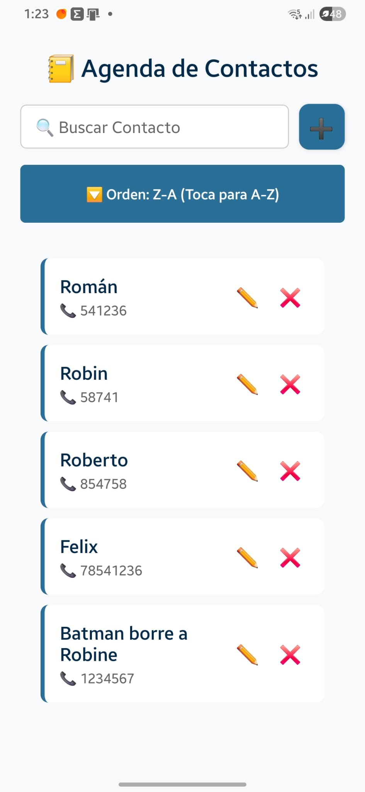
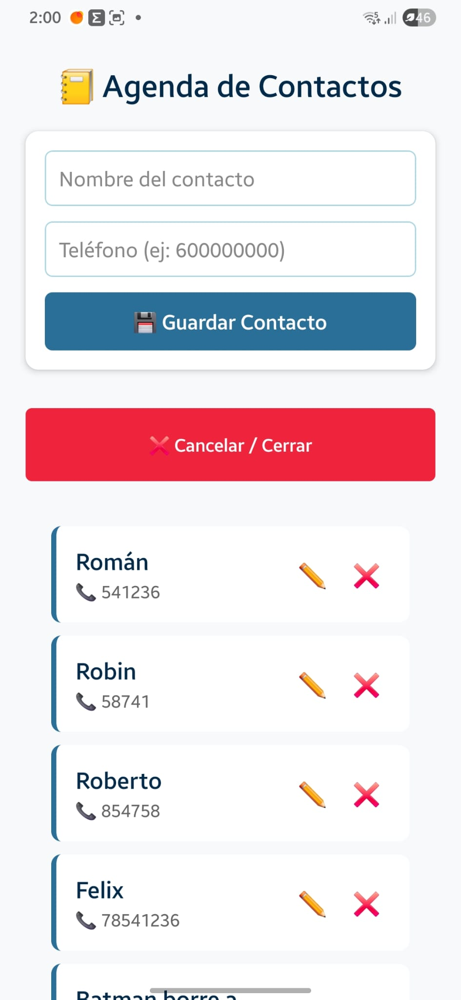

# 🚀 IMPLEMENTACION DE PERSISTECNIA DE DATOS EN REACT NATIVE

Usaremos una librería llamada AsyncStorage.

- Es como el "Local Storage" de la web pero para móviles.
- Nos permitirá que los contactos sobrevivan a un cierre de la aplicación.

Para que nuestra Agenda tenga "memoria a largo plazo", en el mundo de React Native (utilizando Expo SDK 54) se utiliza la librería oficial:

`@react-native-async-storage/async-storage`.

Es un almacén de tipo clave-valor, muy ligero, que guarda los datos directamente en el disco duro del teléfono.

Lo hacemos en 2 pasos :

- Primero instalamos la librería y luego
- Creamos un "Gestor de almacenamiento" (un archivo de servicio) para que se encargue de guardar y leer, dejando nuestro archivo Padre limpio.

## 🪜 Paso 1: Instalar la librería

Al usar Expo, la instalación es muy segura. Se encarga de buscar la versión exacta para el proyecto que tenemos.

Abrimos la terminal en VS Code (en la carpeta raíz del proyecto).
Si el servidor de Expo está corriendo, presionar ctrl + c para pararlo un momento.

Ejecutar el siguiente comando:

---

```Bash
npx expo install @react-native-async-storage/async-storage
```

---

Veremos en pantalla:

---

```bash
PS E:\React Native Con Expo\ProyectosReactNativeConExpo\05_AgendaContactos> npx expo install @react-native-async-storage/async-storage
› Installing 1 SDK 54.0.0 compatible native module using npm
> npm install

up to date, audited 703 packages in 3s

52 packages are looking for funding
  run `npm fund` for details

11 moderate severity vulnerabilities

To address issues that do not require attention, run:
  npm audit fix

To address all issues (including breaking changes), run:
  npm audit fix --force

Run `npm audit` for details.
```

---

Una vez que termine de instalarse, puedes volver a encender tu servidor con npx expo start.

## 🪜 Paso 2: Crear el "Servicio de Persistencia" (Conexion a la base de datos: La Tubería hacia el Disco)

Para no ensuciar el archivo Padre ( entrada al programa : App.js. Claro, aplique control de versiones y entonces el App.js realmente llama la version que este descomentada, en la unica importacion que tenemos en App.js ) con comandos de guardado y lectura, vamos a crear un archivo independiente que se encargue únicamente de hablar con el disco del teléfono.

Vamos la carpeta src/.

Creamos una carpeta nueva llamada `services/`.

Dentro de ella, crea un archivo llamado `contactoService.js`.

Pegamos este código estructurado dentro de `src/services/contactoService.js`:

---

```jsx
// src/services/contactoService.js
import AsyncStorage from "@react-native-async-storage/async-storage";

// Definimos una clave única para que el móvil sepa dónde se guarda nuestra lista
const LLAVE_ALMACENAMIENTO = "@agenda_contactos_key";

export const contactoService = {
  // 💾 Guardar contactos en el disco
  guardar: async (contactos) => {
    try {
      // AsyncStorage solo entiende TEXTO PLANO.
      // Por eso transformamos el array de objetos a un String con JSON.stringify
      const jsonValue = JSON.stringify(contactos);
      await AsyncStorage.setItem(LLAVE_ALMACENAMIENTO, jsonValue);
    } catch (e) {
      console.error("Error al guardar en el disco:", e);
    }
  },

  // 📖 Leer contactos del disco
  obtener: async () => {
    try {
      const jsonValue = await AsyncStorage.getItem(LLAVE_ALMACENAMIENTO);
      // Si hay datos guardados, los destransformamos de texto a Array de objetos.
      // Si está vacío, devolvemos un array vacío [] de seguridad.
      return jsonValue != null ? JSON.parse(jsonValue) : [];
    } catch (e) {
      console.error("Error al leer del disco:", e);
      return [];
    }
  },
};
```

---

### 🧠 Explicación de las palabras async y await

El disco duro de un teléfono es infinitamente más lento que la memoria RAM. Leer o escribir un archivo puede tardar unos milisegundos. Si JavaScript se quedara esperando congelaría la pantalla de la App.

Con `async` le decimos a la función: "Oye, vas a hacer una tarea pesada en segundo plano".

Con `await` le decimos: `"Espera pacientemente a que el disco termine su trabajo antes de pasar a la siguiente línea, pero deja que el resto de la App siga moviéndose"`.

### 🪜 Paso 3: Preparar el nuevo archivo de versión del Padre ( La version que llamaremos a la App.js para que se ejecute como principal)

Como siempre, para no romper tu archivo anterior, vamos a inaugurar una nueva versión de pruebas.

- Vamos a la carpeta `src/versionesApps/`.
- Duplicar el archivo `App_CRUD_BusquedaModificar.js` y renómbralo como `App_CRUD_Persistencia.js`.
- Cambia el conmutador en tu App.js raíz para que apunte a esta versión definitiva:

---

```jsx
import MiVersionApp from "./src/versionesApps/App_CRUD_Persistencia";
```

---

En el siguiente paso entraremos a `App_CRUD_Persistencia.js` para conectar a nuestro nuevo gestor contactoService y ver cómo los contactos sobreviven aunque reinicies la App.

### 🪜 Paso 4: El "Cargador" Inicial (Leer del Disco al Arrancar)

Al igual que en el formulario usamos un `useEffect` para vigilar cuando cambiaba el contacto seleccionado, en el Padre usaremos un `useEffect con la lista de dependencias vacía []`.

💡 Regla de oro: En React, un `useEffect(() => { ... }, []);` con corchetes vacíos al final `significa: "Ejecuta este código una sola vez, justo cuando la aplicación se encienda y aparezca en la pantalla del móvil`".
Es el sitio perfecto para leer el disco duro.

Abrimos src/versionesApps/App_CRUD_Persistencia.js.

Importa useEffect (si no lo tenías ya) y tu nuevo Gestor (contactoService) arriba del todo:

---

```jsx
import React, { useState, useEffect } from "react";
// ... (tus otros imports)
import { contactoService } from "../services/contactoService"; // ◄--- Importamos el Gestor
```

---

Vamos a meter el cargador dentro del componente principal. Como leer del disco es una tarea asíncrona (tarda unos milisegundos), tenemos que crear una pequeña función interna con async/await:

---

```jsx
export default function MiVersionApp() {
  const [listaContactos, setListaContactos] = useState([]);
  const [direccionOrden, setDireccionOrden] = useState('ninguno');
  const [textoBusqueda, setTextoBusqueda] = useState('');
  const [contactoAEditar, setContactoAEditar] = useState(null);

  // 🔄 TUBERÍA DE CARGA: Se activa una sola vez al encender la App
  useEffect(() => {
    const cargarContactosDelDisco = async () => {
      const contactosGuardados = await contactoService.obtainer(); // Le pedimos los datos al Gestor
      setListaContactos(contactosGuardados); // Los subimos a la memoria RAM
    };

    cargarContactosDelDisco();
  }, []); // ◄--- Corchetes vacíos = Solo al arrancar
```

---

### 🪜 Paso 5: El "Guardián" Automático (Salvar en el Disco al cambiar algo)

Ahora necesitamos la otra dirección de la tubería: cada vez que la lista de contactos sufra una alteración (se añada uno, se borre o se modifique), queremos que se guarde en el disco de inmediato de forma transparente.

Podríamos ir función por función metiendo el guardado, pero hay una forma mucho más elegante y automática usando otro useEffect.
¡Vamos a poner a un vigilante a escoltar a la variable `listaContactos`!

Añadimos este segundo useEffect justo debajo del anterior:

---

```jsx
// 💾 TUBERÍA DE GUARDADO: Se activa CADA VEZ que 'listaContactos' cambie en la RAM
useEffect(() => {
  // Evitamos guardar un array vacío si es el arranque inicial de la app
  if (listaContactos.length > 0) {
    contactoService.guardar(listaContactos); // Le decimos al Gestor que actualice el disco
  }
}, [listaContactos]); // ◄--- Vigila de cerca a 'listaContactos'
```

---

### 🧪 Prueba Suprema de la Persistencia

No necesitamos modificar ninguna de las funciones de agregar, borrar o actualizar, porque el segundo useEffect reaccionará de golpe a cualquiera de ellas de forma automática.

- Guardamos el archivo y haz este experimento en Expo Go:
- Abrimos la aplicación (estará completamente vacía).
- Añadimos un contacto real (ej: Nombre: "Batman", Teléfono: "911").
- Añadimos otro contacto (ej: Nombre: "Robin", Teléfono: "555").
- Ahora, cerramos por completo la aplicación en el móvil (Matamos la App = Cerrarla).
- Volvemos a abrir Expo Go y entramos en el proyecto.
- Si el Gestor de Almacenamiento funcionan como es debido, la pantalla no arranca en blanco: ¡Batman y Robin aparecerán plantados en tu pantalla desde el primer milisegundo! El disco duro le habrá devuelto la vida a tus datos.

Exitos: Añadi a Batman y Robin y volvi a entrar.
Inicio con ellos como contacto


# 🎯 El truco de UX: Ocultar el Formulario detrás de un + ( Cambiar el formulario en la pantalla)

Vamos a ocultar el formulario de agregar Contactos dentro de un botón desplegable.

Para lograrlo de una forma elegante, vamos a colocar un botón con un ➕ al lado de la barra de búsqueda. Al pulsarlo, el formulario aparecerá con una bonita transición o desaparecerá si ya estaba abierto.

## 🪜 Paso 1: Crear el estado de visibilidad en el Padre

Abre tu archivo src/versionesApps/App_CRUD_Persistencia.js.
Necesitamos un interruptor (un booleano true/false) para saber si el formulario debe mostrarse o no.

Añade este estado arriba del todo con los demás:

---

```jsx
// Al arrancar, el formulario estará oculto (false)
const [mostrarFormulario, setMostrarFormulario] = useState(false);
```

---

La lógica: Si el usuario pulsa el lápiz ✏️ para editar un contacto, ¡lo lógico es que el formulario se abra automáticamente para que no tenga que pulsar el + manualmente! Así que vamos a modificar tu función seleccionarParaEditar:

---

```jsx
const seleccionarParaEditar = (contacto) => {
  setContactoAEditar(contacto);
  setMostrarFormulario(true); // ◄--- ¡Forzamos la apertura al editar!
};
```

---

## 🪜 Paso 2: Modificar el JSX (El diseño en el return)

Vamos a crear una fila horizontal (flexDirection: 'row') para que la barra de búsqueda y el nuevo botón del + convivan en armonía uno al lado del otro. Además, usaremos un cortocircuito para pintar o esconder el formulario.

Modifica la parte superior de tu return, en `App_CRUD_Persistencia.js`, para que quede así:

---

```jsx
return (
  <View style={globalStyles.container}>
    <Text style={globalStyles.titulo}>📒 Agenda de Contactos</Text>

    {/* 1. INTERRUPTOR INTELIGENTE: Si 'mostrarFormulario' es true, se pinta; si es false, hace cortocircuito */}
    {mostrarFormulario && (
      <ContactoForm
        onAgregarContacto={agregarContactoGlobal}
        contactoSeleccionado={contactoAEditar}
        onActualizarContacto={actualizarContactoGlobal}
      />
    )}

    {/* 2. CONTENEDOR EN FILA PARA BÚSQUEDA + BOTÓN MAS */}
    <View style={{ flexDirection: 'row', alignItems: 'center', marginBottom: 15 }}>

      <TextInput
        style={[globalStyles.inputBusqueda, { flex: 1, marginBottom: 0 }]} // Quitamos el margen inferior para alinearlo
        placeholder="🔍 Buscar contacto..."
        value={textoBusqueda}
        onChangeText={setTextoBusqueda}
      />

      {/* BOTÓN MÁS [+] */}
      <TouchableOpacity
        style={{
          backgroundColor: mostrarFormulario ? '#ef233c' : '#2A6F97', // Rojo si está abierto, Azul si está cerrado
          padding: 10,
          borderRadius: 10,
          marginLeft: 10,
          width: 45,
          height: 45,
          justifyContent: 'center',
          alignItems: 'center',
          elevation: 2
        }}
        onPress={() => setMostrarFormulario(!mostrarFormulario)} // Conmuta entre true y false
      >
        <Text style={{ color: '#fff', fontSize: 20, fontWeight: 'bold' }}>
          {mostrarFormulario ? '❌' : '➕'} {/* Cambia el icono según el estado */}
        </Text>
      </TouchableOpacity>

    </View>

    {/* El resto del código (Botón ordenar y FlatList) se queda exactamente IGUAL */}
```

---

🧪 Tu Prueba de Fuego Visual
Guarda los cambios y mira la pantalla de tu móvil en Expo Go:

Al abrir la app, el bloque blanco del formulario debería haber desaparecido, dejando la lista de tus contactos limpia arriba del todo.

Toca el botón azul con el ➕. El formulario debería aparecer mágicamente. El botón se volverá rojo y mostrará una ❌ para cerrarlo.

Cierra el formulario pulsando la ❌. Ahora ve a la tarjeta de Batman y pulsa el lápiz ✏️.

Si tu lógica conectada está bien pensada, el formulario se desplegará solo, cargará los datos de Batman y cambiará el botón a "Actualizar Contacto".

## La interfaz quedo fea. No me gusto.

## 🛠️ El reajuste arquitectónico del return para mejorar la interfaz visual.

Vamos a hacer que la barra de búsqueda, el botón del + y el botón de ordenar se escondan automáticamente cuando el formulario se abra. Así, la interfaz será limpia y la ❌ solo aparecerá si el formulario está abierto, pero arriba del todo.

Modifica tu return para que quede estructurado de esta manera: CREE App_CRUD_Persistencia_UX.js PARA EJECUTAR ESTA VERSION.

---

```jsx
return (
  <View style={globalStyles.container}>
    <Text style={globalStyles.titulo}>📒 Agenda de Contactos</Text>

    {/* SCENARIO A: Si el formulario está ABIERTO, mostramos el formulario y un botón para cerrarlo ARRIBA */}
    {mostrarFormulario ? (
      <View>
        <ContactoForm
          onAgregarContacto={agregarContactoGlobal}
          contactoSeleccionado={contactoAEditar}
          onActualizarContacto={actualizarContactoGlobal}
        />

        {/* Botón elegante para cancelar/cerrar abajo del formulario */}
        <TouchableOpacity
          style={[
            globalStyles.botonOrden,
            { backgroundColor: "#ef233c", marginTop: 10 },
          ]}
          onPress={() => {
            setMostrarFormulario(false);
            setContactoAEditar(null); // Limpiamos el imán por seguridad si cancela
          }}
        >
          <Text style={globalStyles.botonOrdenTexto}>❌ Cancelar / Cerrar</Text>
        </TouchableOpacity>
      </View>
    ) : (
      // SCENARIO B: Si el formulario está CERRADO, mostramos las herramientas de búsqueda y el botón +
      <View>
        <View style={globalStyles.containerBusquedaYMas}>
          <TextInput
            style={globalStyles.TextInput}
            placeholder=" 🔍 Buscar Contacto"
            value={textoBusqueda}
            onChangeText={setTextoBusqueda}
          />

          <TouchableOpacity
            style={[globalStyles.botonMas, { backgroundColor: "#2A6F97" }]}
            onPress={() => setMostrarFormulario(true)} // Abre el formulario
          >
            <Text style={globalStyles.TextoBorrarYMas}>➕</Text>
          </TouchableOpacity>
        </View>

        {/* El botón de ordenar solo se muestra si estamos buscando/viendo la lista */}
        <TouchableOpacity
          style={globalStyles.botonOrden}
          onPress={conmutadorOrden}
        >
          <Text style={globalStyles.botonOrdenTexto}>
            {direccionOrden === "ninguno" && "🔤 Ordenar Lista"}
            {direccionOrden === "asc" && "🔼 Orden: A-Z (Toca para Z-A)"}
            {direccionOrden === "desc" && "🔽 Orden: Z-A (Toca para A-Z)"}
          </Text>
        </TouchableOpacity>
      </View>
    )}

    {/* LA LISTA SIEMPRE SE MUESTRA ABAJO (Ya sea completa o filtrada) */}
    <FlatList
      data={contactosFiltrados}
      keyExtractor={(item) => item.id}
      renderItem={({ item }) => (
        <ContactoCard
          contacto={item}
          onBorrarContacto={eliminarContactoGlobal}
          onEditarSeleccion={seleccionarParaEditar}
        />
      )}
      contentContainerStyle={{ padding: 20 }}
    />

    <StatusBar style="auto" />
  </View>
);
```

---

🧠 ¿Por qué este cambio soluciona la interfaz?
Contexto Puro:
Cuando entras a la app, solo ves la lupa, el botón ➕ y tus contactos. No hay botones mentirosos.

Desaparece la confusión:
Al pulsar ➕, la barra de búsqueda se desvanece y aparece el bloque de inserción. El usuario sabe perfectamente que está en "Modo Edición/Creación".

El botón del lápiz sigue siendo mágico:
Si pulsas el lápiz ✏️ de Batman con el formulario cerrado, nuestra función seleccionarParaEditar pondrá mostrarFormulario en true, lo que provocará que la pantalla cambie instantáneamente al Escenario A, mostrando el formulario relleno listo para actualizar.

Entro limpio: Con la busqueda arriba y el boton + para agregar contacto o editar.


Pero el boton para cerrar Agregar o Editar es muy feo: Un boton rojo del tamaño de la pantalla.


Arriba el resultado de las pruebas: Diria que mejor , al iniciar con el boton buscar y el simbolo + para crear o editar. `Sin embargo ese boton rojo gigante, aunque se ve mucho, no esta bien`.

Propuesta:
Algo como una X, en la esquina superior derecha, en el formulario de creacion/edicion .

## Mover el botón de cierre en forma de una ❌ pequeña dentro de la esquina superior derecha del formulario.

Eso es el estándar de la industria (como una ventana modal o un diálogo). No es un cambio radical en la lógica profunda, pero sí requiere alterar un poco el código de "maquetación" (JSX) y los estilos.

Para lograrlo, tenemos dos opciones de diseño limpio. Vamos a verlas para que elijas la que mejor se adapte a tu gusto:

## Opción A: Una X dentro del Formulario ( ContactoForm.js)

Poner la ❌ dentro del Formulario (El Hijo se encarga)
Dado que el formulario ya es una caja blanca con bordes redondeados (borderRadius: 8), lo más natural es que la cruz de cerrar viva dentro de esa misma caja, arriba a la derecha.

Para que esto funcione de manera modular, el Hijo (ContactoForm.js) debe mostrar la cruz y, al presionar la cruz, avisar al Padre para que se cierre.

1. En el Hijo (src/components/ContactoForm.js)
   Modificamos el JSX del formulario para añadir un contenedor con el título y la cruz alineados horizontalmente:

---

```jsx
// src/components/ContactoForm.js
// formulario para los contactos
import React, { useEffect, useState } from "react"; // <- 1. Importamos el useState
import {
  View,
  TextInput,
  TouchableOpacity,
  Text,
  StyleSheet,
  Alert,
} from "react-native";
import { colores } from "../styles/globalStyles";

// 1. Recibimos las propiedades en el argumento de la funcion (Añadimos onCancelar)
export default function ContactoForm({
  onAgregarContacto,
  contactoSeleccionado,
  onActualizarContacto, // nueva propiedad para actualizar.
  onCancelar, // ◄--- NUEVA: Tubería para que el Padre cierre el formulario
}) {
  // 2. Creamos los 2 almacenes temporales para el texto
  const [nombre, setNombre] = useState("");
  const [telefono, setTelefono] = useState("");

  // Usamos useEffect para detectar que contactoSeleccionado cambio en ContactoCard.
  useEffect(() => {
    if (contactoSeleccionado) {
      // Si el padre nos mando un contacto, rellenamos el input
      setNombre(contactoSeleccionado.nombre);
      setTelefono(contactoSeleccionado.telefono);
    }
  }, [contactoSeleccionado]); // La dependencia : Vigila el cambio de contactoSeleccionado

  // 3. Funcion para procesar el guardado o actualizacion
  const presionarGuardar = () => {
    if (nombre.trim() === "" || telefono.trim() === "") {
      Alert.alert("Error", "Por favor rellena los campos");
      return;
    }
    //DETECTAMOS SI ES CREACION O EDICION
    if (contactoSeleccionado) {
      // Si estamos editando, enviamos el ID original junto con el nuevo nombre y/o telefono
      onActualizarContacto(contactoSeleccionado.id, nombre, telefono);
    } else {
      onAgregarContacto(nombre, telefono);
    }

    //Limpiamos los inputs, sea actualizar o guardar
    setNombre("");
    setTelefono("");
  };

  return (
    <View style={styles.formContainer}>
      {/* ◄--- NUEVO: Cabecera interna del formulario para la X de cierre */}
      <View style={styles.cabeceraForm}>
        <Text style={styles.tituloForm}>
          {contactoSeleccionado ? "📝 Editar Contacto" : "✨ Nuevo Contacto"}
        </Text>
        <TouchableOpacity onPress={onCancelar}>
          <Text style={styles.botonCerrarX}>❌</Text>
        </TouchableOpacity>
      </View>

      <TextInput
        style={styles.input}
        placeholder="Nombre del contacto"
        placeholderTextColor="#888"
        value={nombre} // <- Vinculamos el valor al useState nombre
        onChangeText={setNombre} // <- Cada letra que se escribe cambia el estado.
      />
      <TextInput
        style={styles.input}
        placeholder="Teléfono (ej: 600000000)"
        placeholderTextColor="#888"
        keyboardType="phone-pad" // Muestra el teclado numérico en el móvil
        value={telefono} // <- Vinculamos el valor al useState telefono }
        onChangeText={setTelefono} // <- Cada numero cambia el estado
      />
      {/* Conectamos el boton a nuestra funcion.*/}
      <TouchableOpacity style={styles.boton} onPress={presionarGuardar}>
        {/* Si hay un contacto seleccionado , el boton cambia a Actualizar */}
        <Text style={styles.botonTexto}>
          {contactoSeleccionado
            ? "🔄 Actualizar Contacto"
            : "💾 Guardar Contacto"}
        </Text>
      </TouchableOpacity>
    </View>
  );
}

// Estilos específicos y locales de este formulario
const styles = StyleSheet.create({
  formContainer: {
    backgroundColor: colores.blanco,
    padding: 15,
    borderRadius: 10,
    shadowColor: "#000",
    shadowOffset: { width: 0, height: 2 },
    shadowOpacity: 0.1,
    shadowRadius: 4,
    elevation: 3, // Sombra para Android
    marginBottom: 20,
  },
  // ◄--- NUEVO: Fila para separar el título de la X
  cabeceraForm: {
    flexDirection: "row",
    justifyContent: "space-between", // Empuja el texto a la izquierda y la X a la derecha
    alignItems: "center",
    marginBottom: 15, // Espacio antes del primer TextInput
  },
  // ◄--- NUEVO: Estilo del pequeño texto de estado interno
  tituloForm: {
    fontSize: 16,
    fontWeight: "bold",
    color: colores.primario,
  },
  // ◄--- NUEVO: Espaciado táctil para que sea fácil pulsar la X
  botonCerrarX: {
    fontSize: 16,
    padding: 5,
  },
  input: {
    borderWidth: 1,
    borderColor: colores.secundario,
    borderRadius: 6,
    padding: 10,
    fontSize: 16,
    marginBottom: 12,
    color: colores.texto,
  },
  boton: {
    backgroundColor: colores.primario,
    padding: 12,
    borderRadius: 6,
    alignItems: "center",
  },
  botonTexto: {
    color: colores.blanco,
    fontSize: 16,
    fontWeight: "bold",
  },
});
```

---

2. En tus Estilos del Formulario (src/components/ContactoForm.js)
   Para colocar la cruz arriba a la derecha de forma limpia sin romper los inputs:

JavaScript
const styles = StyleSheet.create({
cardFormulario: {
backgroundColor: colores.blanco,
padding: 20,
borderRadius: 12,
marginBottom: 15,
elevation: 3, // Una sombra sutil para despegarlo del fondo
},
cabeceraForm: {
flexDirection: 'row',
justifyContent: 'space-between', // Empuja el título a la izquierda y la X a la derecha
alignItems: 'center',
marginBottom: 15,
},
tituloForm: {
fontSize: 16,
fontWeight: 'bold',
color: colores.primario,
},
botonCerrarIcono: {
fontSize: 16,
padding: 5,
},
// ... tus otros estilos de inputs y botones fijos
});

````
---

## 🪜 Siguiente paso en el Padre (App_CRUD_Persistencia_UX.js)
Para que la app funcione con esta nueva estructura, solo debes ir a tu archivo del Padre y sustituir el bloque del formulario por este (eliminando el botón rojo gigante que tenías abajo):

Aquí tienes el return completo y estructurado para tu archivo App_CRUD_Persistencia_UX.js.

He eliminado el botón rojo gigante anterior y he reorganizado los bloques para que el nuevo sistema de escenarios condicionales funcione en perfecta armonía con tu archivo de estilos independientes (globalStyles.js):

---
```jsx
return (
    // Usamos el contenedor global solo para heredar los márgenes y el fondo limpio
    <View style={globalStyles.container}>
      <Text style={globalStyles.titulo}>📒 Agenda de Contactos</Text>

      {/* ESCENARIO A: Si el formulario debe mostrarse (true) */}
      {mostrarFormulario ? (
        <ContactoForm
          onAgregarContacto={agregarContactoGlobal}
          contactoSeleccionado={contactoAEditar}
          onActualizarContacto={actualizarContactoGlobal}
          onCancelar={() => {
            setMostrarFormulario(false);
            setContactoAEditar(null); // Limpiamos el imán por seguridad al cerrar
          }}
        />
      ) : (
        // ESCENARIO B: Si el formulario está oculto (false), mostramos la barra de búsqueda y el botón +
        <View>
          {/* CONTENEDOR EN FILA PARA EL BOTÓN + JUNTO A BUSCAR */}
          <View style={globalStyles.containerBusquedaYMas}>
            {/* INPUT DE BUSQUEDA */}
            <TextInput
              style={globalStyles.TextInput}
              placeholder=" 🔍 Buscar Contacto"
              value={textoBusqueda}
              onChangeText={setTextoBusqueda} // Cada letra se actualiza
            />

            {/* BOTÓN MAS [+] */}
            <TouchableOpacity
              style={[
                globalStyles.botonMas,
                { backgroundColor: "#2A6F97" }, // Azul fijo ya que solo se muestra para abrir
              ]}
              onPress={() => setMostrarFormulario(true)} // Abre el formulario al pulsar
            >
              <Text style={globalStyles.TextoBorrarYMas}>➕</Text>
            </TouchableOpacity>
          </View>

          {/* BOTÓN GENÉRICO PARA ORDENAR A-Z */}
          <TouchableOpacity
            style={globalStyles.botonOrden}
            onPress={conmutadorOrden}
          >
            <Text style={globalStyles.botonOrdenTexto}>
              {direccionOrden === "ninguno" && "🔤 Ordenar Lista"}
              {direccionOrden === "asc" && "🔼 Orden: A-Z (Toca para Z-A)"}
              {direccionOrden === "desc" && "🔽 Orden: Z-A (Toca para A-Z)"}
            </Text>
          </TouchableOpacity>
        </View>
      )}

      {/* LA LISTA (FLATLIST) SIEMPRE SE MUESTRA ABAJO EN AMBOS ESCENARIOS */}
      <FlatList
        data={contactosFiltrados} // Enviamos el array filtrado u ordenado de la RAM
        keyExtractor={(item) => item.id} // El id único del contacto
        renderItem={({ item }) => (
          <ContactoCard
            contacto={item}
            onBorrarContacto={eliminarContactoGlobal}
            onEditarSeleccion={seleccionarParaEditar} // Conectamos el puente hacia el lápiz ( ✏️ )
          />
        )}
        contentContainerStyle={{ paddingBottom: 20 }} // Espacio al final para que no choque con el borde físico
      />

      <StatusBar style="auto" />
    </View>
  );
````

---

🔍 Puntos clave de este bloque:
El operador ternario mostrarFormulario ? (...) : (...): Divide limpiamente tu pantalla en dos mitades exclusivas. O se ve el editor, o se ven los controles de búsqueda.

onCancelar en acción:
Al pulsar la ❌ interna del hijo, se ejecuta la función de flecha que pusimos en el escenario A, regresando mostrarFormulario a false y bajando el telón.

La lista es un elemento común:
Como la FlatList está fuera del bloque condicional, da igual si estás creando, editando o buscando; tus tarjetas de contactos siempre se pintarán abajo de forma estable.

Prueba a guardar el archivo con este return en tu versión UX y verifica en tu teléfono cómo la experiencia de usuario cambia drásticamente a una mucho más fluida. ¡Me avisas cuando esté listo!
